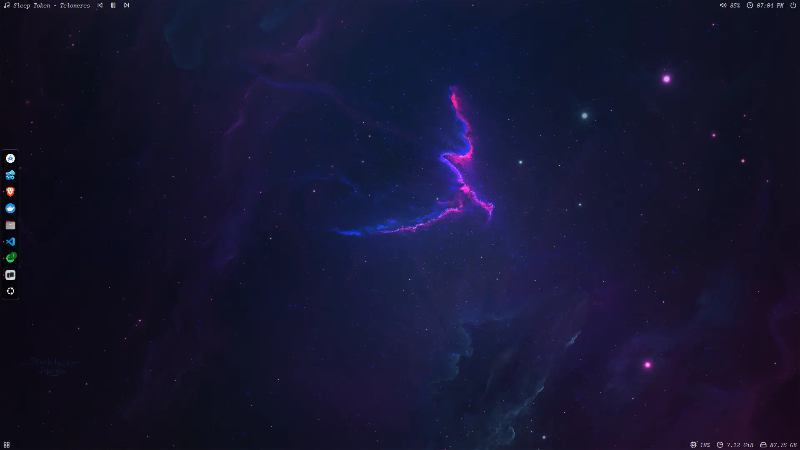
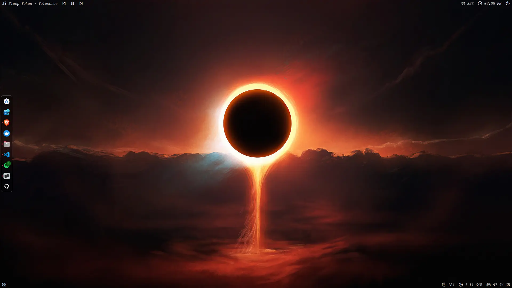
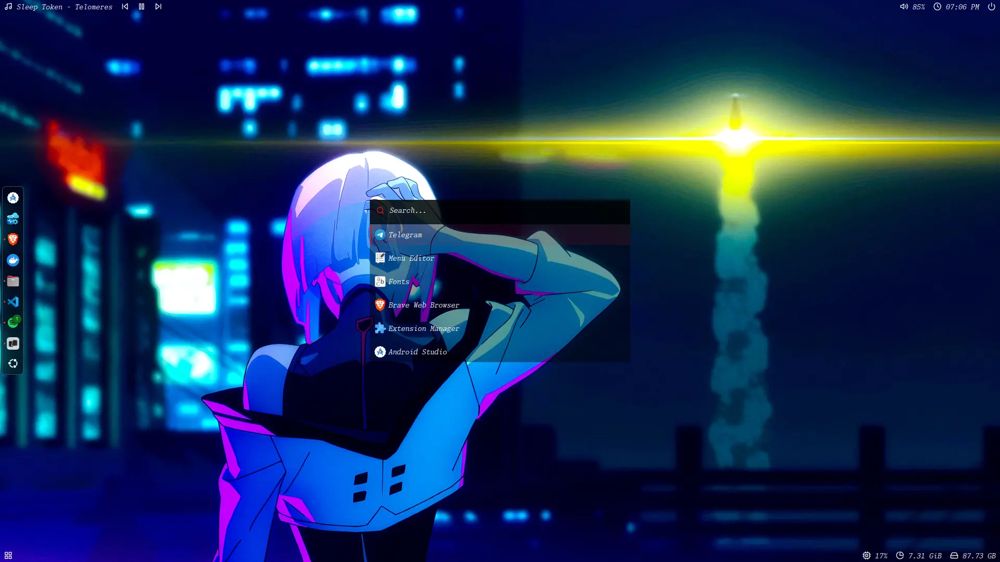

# Polybar Cuts Theme

Un tema personalizado para Polybar con diseño minimalista y funcional. Incluye integración con Spotify y accesos directos a aplicaciones comunes.

## Tabla de Contenidos

- [Requisitos Previos](#requisitos-previos)
- [Instalación](#instalación)
- [Configuración](#configuración)
- [Notas Adicionales](#notas-adicionales)
- [Capturas de Pantalla](#capturas-de-pantalla)

## Requisitos Previos

Antes de comenzar, asegúrate de tener instalado:

- **Polybar**: Consulta la [documentación oficial](https://github.com/adi1090x/polybar-themes?tab=readme-ov-file) para instrucciones de instalación.
- **Git**: Para clonar el repositorio.
- **Fuente Monaspace (Opcional)**: Este tema utiliza la fuente Monaspace. Puedes descargarla desde [Monaspace Github](https://monaspace.githubnext.com/). Si prefieres no instalarla, puedes modificar la configuración para usar una fuente del sistema.

## Instalación

### 1. Clonar el repositorio

```bash
git clone https://github.com/jordy756/polybar-cuts.git
```

### 2. Copiar archivos de configuración

```bash
cp -r polybar-cuts/.config/polybar ~/.config/polybar
```

**Nota:** Si ya tienes una configuración de Polybar existente, considera hacer un respaldo antes:

```bash
mv ~/.config/polybar ~/.config/polybar.backup
```

### 3. Instalar dependencias

#### Spotify

1. Instala Spotify desde la [página oficial](https://www.spotify.com/download/linux/)

2. Instala `playerctl` para controlar la reproducción:

   ```bash
   sudo apt install playerctl
   ```

#### Control de volumen

```bash
sudo apt install pulseaudio-utils
```

## Configuración

### Crear atajo de teclado

Crea un atajo personalizado para alternar Polybar fácilmente:

1. **Comando a ejecutar:**

   ```bash
   /home/<tu-usuario>/.config/polybar/cuts/scripts/toggle-polybar.sh
   ```

   > **Importante:** Reemplaza `<tu-usuario>` con tu nombre de usuario real del sistema.

2. **Asigna la combinación de teclas:** `Super + F`

### Inicio automático (Opcional)

Para que Polybar se inicie automáticamente con tu sesión:

1. Navega al directorio de autoarranque:

   ```bash
   mkdir -p ~/.config/autostart
   cd ~/.config/autostart
   ```

2. Crea el archivo `polybar.desktop`:

   ```bash
   nano polybar.desktop
   ```

3. Agrega el siguiente contenido:

   ```ini
   [Desktop Entry]
   Type=Application
   Name=Polybar
   Comment=Launch Polybar
   Exec=bash -c "killall polybar; bash ~/.config/polybar/launch.sh --cuts"
   Terminal=false
   X-GNOME-Autostart-enabled=true
   ```

4. Guarda y cierra el archivo (`Ctrl + O`, `Enter`, `Ctrl + X` en nano).

## Notas Adicionales

- Eliminar la carpeta de examples.
- Si solo quieres usar este tema y eliminar otras configuraciones de Polybar existentes, borra el contenido de `~/.config/polybar` antes de copiar los archivos del repositorio.
- Asegúrate de que el script `toggle-polybar.sh` tenga permisos de ejecución:

  ```bash
  chmod +x ~/.config/polybar/cuts/scripts/toggle-polybar.sh
  ```

- Para verificar que Polybar se está ejecutando correctamente, puedes lanzarlo manualmente:

  ```bash
  bash ~/.config/polybar/launch.sh --cuts
  ```

- Instalar Extensiones de GNOME (si usas GNOME) para ocultar la barra superior y el dock puede mejorar la apariencia del tema, en mi caso utilizo:
  - [Hide Top Bar](https://extensions.gnome.org/extension/545/hide-top-bar/)
  - [Dash to Dock](https://extensions.gnome.org/extension/307/dash-to-dock/)
  - [Blur My Shell](https://extensions.gnome.org/extension/3193/blur-my-shell/)

## Capturas de Pantalla




